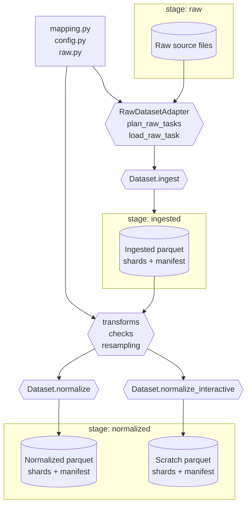
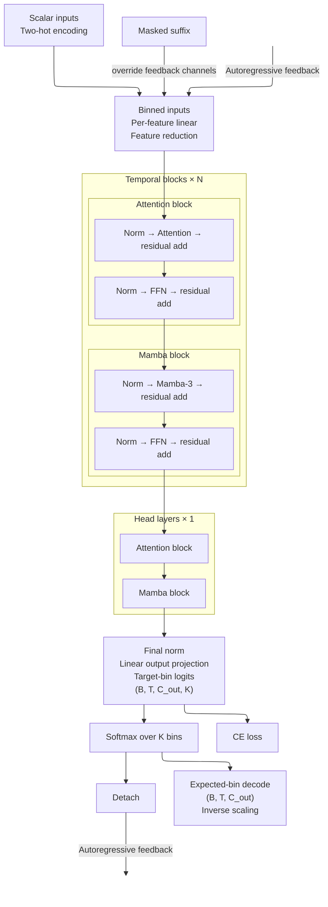

# batgrad documentation

`batgrad` is a template for reproducible, data-driven battery modeling. It
separates a durable data pipeline from configurable ML experiments: source
measurements become canonical, traceable datasets, and each ML run explicitly
selects the data and behavior it needs.

The repository is intended to be explored and extended rather than treated as
a fixed model package. Use the [Quick Start](quick-start.md) for the operational
workflow, and use the notebooks to inspect each stage interactively:

- `notebooks/etl.py` explores ingestion, transformations, and normalization.
- `notebooks/dataloader.py` exposes manifests, indexes, loaders, and batches.
- `notebooks/config.py` builds and validates experiment configurations.
- `notebooks/training.py` steps through real training batches and plots exact objective traces.
- `notebooks/inference.py` loads checkpoints and runs model inference.

These five files are the standalone notebook entrypoints. Open them in Marimo edit
mode to add investigation cells; modules under `notebooks/_support/` are shared
implementation details rather than additional entrypoints.

Released normalized data uses approximately 7.2 GiB, and the Mamba-3 checkpoint requires Linux and
CUDA. Raw Pozzato processing needs much more storage; synthetic raw data and generation code are not
public here.

## Data flow

The data layer creates one canonical representation of each dataset, independent
of any later ML task. Its persisted flow is:

```text
raw source files -> ingested Parquet + manifest -> normalized Parquet + manifest
```

The Parquet data is sharded by protocol. The accompanying manifest describes
which streams exist, where their exact row segments live, and which metadata and
provenance belong to them.

### Included datasets

| Dataset | Conditions | Protocols | Availability |
| --- | --- | --- | --- |
| `pozzato-2022` | CC-CV charging and dynamic discharge cycling at 23 °C | Cycling, HPPC, RPT, EIS | Raw and normalized |
| `synthetic-pozzato-2022-m50t` | 10–30 °C, five cooling settings, four dynamic profile scales | Cycling, RPT, EIS | Normalized only |

Pozzato's source chamber was 23 °C; its normalized ambient temperature and cooling alpha are fixed
to 20 °C and 20 W·m⁻²·K⁻¹. The synthetic release carries its varied ambient and cooling conditions
in the time-series inputs.

### Define a dataset

Dataset-specific behavior is kept at the edge of the system:

- `mapping.py` translates source columns into canonical names and can define
  aliases, dtypes, and parsers.
- `raw.py` discovers and loads source files through a `RawDatasetAdapter`.
- `config.py` declares protocols, columns, task metadata, transformations,
  checks, and resampling.

This boundary lets generic processing work with stable column names and task
metadata instead of vendor-specific names or file layouts. A source that is
already tabular still passes through the ingestion contract so it receives the
same validation, manifest layout, and provenance as other datasets.



### Ingest source data

Ingestion turns source-specific batches into the canonical schema. It resolves
column mappings, applies parsers and dtypes, validates required metadata, and
writes protocol-sharded Parquet. Source paths and task metadata are retained so
later stages can trace each segment back to its origin.

Ingestion does not make task-specific ML decisions. Its purpose is to provide a
consistent and inspectable representation of the source data.

### Normalize for downstream use

Normalization starts from the ingested manifest, assembles configured tasks,
and applies transformations, checks, and resampling. It is broader than simple
downsampling: a policy may derive values, reject invalid measurements, create a
regular grid, or reduce a dense stream while preserving important structure.

Persisted normalization produces the stable normalized stage used by analysis
and ML. Interactive normalization follows the same processing logic but writes
an isolated scratch result. This makes it possible to inspect a subset or tune a
transformation without replacing the persisted output.

### Use manifests as the handoff

A manifest is the contract between stages. It indexes exact shard ranges and
records protocol, task metadata, and provenance; readers do not need to infer
stream boundaries from filenames or scan every shard first.

Processed outputs also carry Git provenance. An ML configuration records the
expected commit prefix for each selected manifest, providing a guard against
accidentally training on a different dataset revision. This improves
reproducibility, but it is not an immutable data-versioning system.

Datasets remain self-contained under their own roots. ML can combine several
normalized manifests while retaining dataset identity in its grouping keys, so
physical datasets do not need to be merged before they can participate in the
same experiment.

See the [data configuration](api/data/configuration.md),
[ingested data](api/data/ingested.md), [normalized data](api/data/normalized.md),
[transformations](api/data/transformations.md), and [contracts](api/contracts.md)
references for the detailed API.

## ML flow

The ML layer consumes normalized manifests, not raw files. An experiment
configuration defines the complete run contract: data revisions, protocols,
columns, scaling, windows, model structure, optimization, validation, logging,
and checkpoint behavior. The public developer entry points are collected in the
[ML API reference](api/ml/configuration.md).

```text
select normalized manifests
  -> build train and validation streams
  -> materialize shifted input/target windows
  -> encode inputs and calculate target distributions
  -> mix features over time and emit logits
  -> optimize the selected training objective
  -> validate held-out windows and anchored rollouts
  -> load a checkpoint for inference
```

### Current implementation boundaries

The ML layer is an experiment template rather than a production training
platform. Its current supported boundary is intentionally narrow:

- Every selected input and target has one explicit scaling rule in the saved
  experiment configuration.
- The built-in trainer uses categorical cross-entropy, AdamW, and either cosine
  warmup or no scheduler.
- Sequential loading traverses requested protocols in order. Shuffled protocol
  groups support cycling, HPPC, and RPT, but not EIS.
- Finite stateful groups can drop incomplete tails, and whole-stream batches
  truncate longer lanes to the shortest lane.
- Mamba requires Linux, CUDA, and the `ml` dependency group; cross-window state
  carry requires SISO layers.
- Checkpoints contain full training state, but `run.init_from` restores compatible
  model weights only and is not a resume mechanism.
- Comparative inference starts each selected stream at source-row offset zero and
  does not currently support EIS.

### Configure the experiment

Inputs, targets, and feedback channels are selected by canonical column name.
This keeps the ML task independent of source-file naming and allows compatible
datasets to participate in the same run.

- **Input columns** are measurements and controls available to the model.
- **Target columns** are quantities the model predicts.
- **Feedback columns** are targets that are also inputs and can be replaced by
  model predictions during rollout.

In the baseline, time difference, current, ambient temperature, and cooling alpha are known
controls. Terminal voltage and surface temperature are observed in the context, predicted as
targets, and fed back during rollout. Held-out rollouts retain recorded future controls; rollout
extensions can supply new values, while omitted controls repeat their final observed value.

The selected manifests are checked against requested protocols, columns, and
scaling ranges before training. Splits are formed from manifest task metadata
rather than random rows, keeping related streams together and reducing leakage
between nearby measurements. Fractional validation sampling selects
`int(group_count * fraction)` groups, so small datasets may need explicit groups
to ensure that a validation split exists.

### Build temporal windows

The loader scales selected values and materializes fixed-length windows. Targets
are deliberately shifted one source row ahead of inputs:

```text
inputs[k]  = stream[offset + k][input columns]
targets[k] = stream[offset + k + 1][target columns]

inputs:  (B, T, C_in)
targets: (B, T, C_out)
```

Consequently, `logits[k]` correspond to `targets[k]`, whose values come from source row
`k + 1`. For a paired feedback column, that is also the same-column value in
`inputs[k + 1]` when the next input row is present in the materialized sequence.
Predictions are converted back to physical units only by inverse scaling. This
next-row contract is used consistently by training, rollouts, loss masks, and
feedback writes below.

Loader strategies determine how windows are ordered and shuffled. Stateful
groups can retain consecutive windows from one stream when a model needs
continuity beyond one context. Dataset, cell, cycle, and protocol metadata
remain available for grouping and validation selection.

Null input values use the `-2.0` sentinel before categorical encoding. Encoding clamps
finite values to each configured input range, so the sentinel becomes the lowest-bin
representation rather than a dedicated missing-value token. Null targets remain `NaN`
and are excluded by the finite-target loss mask. The row mask separately identifies
positions backed by real source rows rather than padded tail rows.

### Encode and mix features

The diagram shows the architecture in `configs/ml_baseline.json`. Its zero-sigma
encoding uses adjacent-bin interpolation, and it applies four temporal blocks followed
by one repetition of the same block in the head layers.



Each scalar is represented as a distribution over `K` bins. Feature-wise linear
projections map those distributions into learned embeddings, then pooling merges
the feature axis into one token per time step. This is feature pooling, not
temporal pooling. Temporal layers preserve the time axis while mixing information
from available context. The diagram's Attention and Mamba blocks are shorthand for
the corresponding configured layer followed by its FFN; implementation layers remain
independently configurable and execute in JSON order.

New masked feedback positions use all-zero, non-normalized bin vectors for every
configured feedback channel. Available detached predictions are applied afterward and
can replace those vectors directly without decoding and re-encoding a scalar. The two
autoregressive-feedback arrows show the write and reuse ends of the same runtime path
without closing the diagram loop; reuse occurs in a later model call, not recursively
within one parallel suffix forward.

Target-bin logits feed categorical cross-entropy directly. The loss also consumes an
encoded target distribution and finite row/channel selection masks, omitted from the
diagram for clarity. Expected-bin decoding first returns values in configured
output-scaled model units. The diagram's inverse-scaling step is the optional
presentation or inference conversion to physical units and is never applied before
feedback reuse.

Feature reduction is the shape transition from `(B, T, C_in, D)` to `(B, T, D)`.
Temporal and head layer sequences remain configurable, but all operate on the
reduced temporal sequence.

```text
scalar inputs              (B, T, C_in)
bin distributions          (B, T, C_in, K)
feature embeddings         (B, T, C_in, D)
one temporal token/step    (B, T, D)
target-bin logits          (B, T, C_out, K)
```

`B` is batch size, `T` is time, `C_in` and `C_out` are selected feature counts,
`K` is the number of bins, and `D` is model width. The model path is:

```text
# x: (B, T, C_in)
x_bins = encode_bins(x)                            # (B, T, C_in, K)
x_bins = apply_feedback_bin_overrides(x_bins)      # zeros or detached predictions

feature_h = stack([
    feature_linear[c](x_bins[:, :, c, :])
    for c in input_features
])                                                  # (B, T, C_in, D)
h = feature_h

for layer in main_layers:
    if layer.kind == "reduce":
        h = sum(h, axis=input_features)            # (B, T, D)
        continue
    update = layer(norm(h))
    h = h + update if layer.uses_residual else update

for layer in head_layers:
    update = layer(norm(h))
    h = h + update if layer.uses_residual else update

h = final_norm(h)
flat_logits = output_linear(h)                     # (B, T, C_out * K)
logits = reshape(flat_logits, B, T, C_out, K)
```

Normalization occurs before each temporal operation. When a layer has a
residual, its update is added to the unchanged input state. Input feature
pooling and final output projection do not have a residual path.

The baseline's attention layers are causal. During objective evaluation, row validity
masks gate attention queries and keys; FFN and Mamba layers still compute all rows.
Rollout execution relies on constructed context windows and does not pass that row
validity mask into attention.

### Produce distributions and calculate loss

The final values are unnormalized logits, one vector of length `K` for every
time step and target feature. Axis `C_out` follows configured `target_columns` order.
Target scalars are encoded into the same bin space. Values outside configured ranges
are clamped to the nearest endpoint before encoding. With the baseline's zero sigma,
a value can contribute to its two neighboring bins; positive sigma instead produces a
normalized Gaussian over all bin centers:

```text
position = normalize_to_unit_range(value) * (K - 1)
lower = floor(position)
upper = ceil(position)
fraction = position - lower

target_distribution[lower] += 1 - fraction
target_distribution[upper] += fraction
```

The categorical objective compares the logits with that soft target
distribution:

```text
log_probabilities = log_softmax(logits, axis=bins)
loss_per_value = -sum(target_distribution * log_probabilities, axis=bins)
loss = mean(loss_per_value at valid, selected positions)
```

A selection with no finite valid target values contributes differentiable zero loss and
zero count rather than `NaN`.

For interpretation, logits become probabilities and are decoded by their
expected bin location:

```text
probabilities = softmax(logits, axis=bins)
expected_bin = sum(probabilities * normalized_bin_centers, axis=bins)
scaled_prediction = output_min + expected_bin * (output_max - output_min)
```

Cross-entropy is the optimization objective. Decoded RMSE is also tracked for
validation in the configured output-scaled units; presentation and inference can
subsequently inverse scale predictions to physical units.

### Train on ordinary or masked windows

Without masked-suffix training, the model receives each selected input window,
produces logits, and calculates categorical cross-entropy over all valid target
values. This is the teacher-forced path.

Masked-suffix training reserves the final `S` input positions of a context for
prediction. Every configured feedback channel in that destination suffix is encoded as
an all-zero bin vector, while supplied controls remain available.

```text
input_suffix      = [T - S : T]        # input rows to replace with predictions
prediction_slice  = [T - S - 1 : T - 1]  # logits that predict those input rows

mask feedback inputs in input_suffix
encoded = encode_bins(window_inputs)
logits = model(encoded, state_at_window_start)

if loss_on_masked_only:
    loss = categorical_cross_entropy(
        logits[prediction_slice],
        window_targets[prediction_slice],
        configured feedback targets,
    )
else:
    loss = categorical_cross_entropy(logits, window_targets, all valid targets)

prediction = detach(softmax or decode(logits[prediction_slice]))
write prediction into paired feedback inputs at input_suffix
```

All selected suffix positions are predicted together in this model call, and feedback
is written only after the full logits tensor exists. The preceding-logit slice follows
the shifted target contract: `logits[k]` correspond to the target sourced from row
`k + 1`. Generated feedback is detached, so gradients do not flow through a generated
value after it becomes a later input. The baseline sets `roll_forward_steps` to zero,
so its training objective does not consume those writes in another internal window;
rollout evaluation does.

#### Roll training forward

Training can extend each loader sequence by `R` positions and apply this
objective to a chain of overlapping contexts. Each shift is at most the suffix
width, so later windows can consume feedback generated by earlier ones.

```text
loader returns T + R positions
start = 0
remaining = R

repeat:
    run the masked window at feedback[start : start + T]
    accumulate its loss sum and valid-element count

    if remaining == 0:
        stop

    shift = min(S, remaining)
    start += shift
    remaining -= shift

loss = sum(all window loss sums) / sum(all valid-element counts)
```

Target validity always combines the row/channel loss mask with finite target
values. The same count is used for ordinary backward, detached per-window
backward, reported metrics, and global count weighting under distributed
training.

When `loss_on_masked_only` is false, every overlapping training window scores all of
its valid targets, so values in an overlap are intentionally counted once per window
that contains them. Rollout scoring instead selects only newly generated destinations.

If the final shift is shorter than `S`, only that many newly encountered tail
positions are masked and predicted. Earlier generated values remain visible in
the overlapping context: probability-feedback mode reuses their detached bin
distributions, while decoded-feedback mode encodes their previously written
scalar values normally. Newly encountered destinations use the all-zero bin mask
in either mode.

When configured to detach between windows, each
`window_loss_sum / total_loss_count` is backpropagated separately and recurrent
state is detached before the next window. Otherwise, the aggregate normalized
loss is backpropagated once.

### Carry state during training

The model accepts recurrent state separately for every stateful layer and batch
lane, but the state itself has no stream or protocol identity. The caller owns
that association. During training, loader groups and step indices determine when
state is retained, reset, or deliberately carried through an aligned protocol
chain. The state represents the position at the **start** of a window. A full
overlapping-window forward cannot supply the next start state because it would
process the overlap twice. Instead, a no-loss prefix forward advances state by
exactly the shift between window starts:

```text
# prediction and loss forward
logits, ignored_final_state = model(
    full_window,
    states=state_at_window_start,
    return_states=true,
)

# state-only forward; logits are discarded
_, state_at_next_window_start = model(
    full_window[:shift],
    states=state_at_window_start,
    return_states=true,
)
```

For a context starting at position `0` whose successor starts at `S`, only
positions `[0:S)` advance state. The successor then runs with a state aligned to
its own first position and processes its visible window exactly once.

Within roll-forward training, this looks like:

```text
states = initial_states

for window_start, next_shift in roll_forward_windows:
    logits = model(window, states=states)
    calculate window loss and write detached feedback

    if next_shift > 0 and carry_state:
        states = state_only_forward(window[:next_shift], states)
        if detach_between_windows:
            states = detach(states)
```

The loader can also arrange consecutive, non-overlapping windows from one stream
or an explicitly aligned protocol chain as a stateful group. State is carried to
a batch only when the group matches and its step index immediately follows the
previous one:

```text
if same_stateful_group and current_step == previous_step + 1:
    initial_states = carried_states
else:
    initial_states = None

run masked-suffix training, including internal roll-forward windows

if another step remains in this stateful group:
    _, carried_states = model(
        final_context_with_generated_feedback,
        states=state_at_final_context_start,
        return_states=true,
        gradients=false,
    )
    carried_states = detach(carried_states)
else:
    carried_states = None
```

The extra no-gradient forward refreshes exported state after generated feedback
has been inserted into the final context. It contributes no loss. State resets
at the first or final step of a group, on group changes, or whenever steps are
not consecutive. Ordinary teacher-forced training does not carry state between
loader batches.

## ML validation

Validation uses held-out groups selected from manifest metadata. It measures two
different behaviors because window-level accuracy alone does not show whether a
feedback model remains reliable after consuming its own predictions.

### Validate held-out windows

Held-out window validation evaluates the configured ordinary or masked-suffix
objective without recursively passing a prediction into another validation
window. It efficiently measures generalization under known context.

```text
model.eval()
disable gradients

for held-out window, up to the configured batch limit:
    run one ordinary or masked-suffix forward
    do not feed predictions into another validation-loader batch
    accumulate categorical cross-entropy sums and valid-element counts
    accumulate per-target loss and decoded squared-error sums and counts

report globally count-weighted loss, per-target loss, and RMSE
```

Aggregate RMSE is micro-averaged over all valid target values; per-target RMSE remains
available separately. Decoded values are still in output-scaled model units here.

Validation can inherit or override suffix settings, but training roll-forward is
disabled for this pass. Recurrent state is not carried between validation-loader
batches.

### Validate rollouts

Rollout validation starts from configured anchors in held-out streams. It keeps
future non-feedback controls from the held-out sequence, but recursively writes
predicted feedback into the matching future input channels. This exposes errors
that accumulate beyond a known input context.

Each anchor is evaluated from its configured context window. Recurrent state is
initialized at that context boundary; validation does not replay earlier stream
rows before the context to warm state. Increase `seq_len` when an anchor needs
more observed history.

An anchor identifies the final observed input row in its context. It must be at
least `seq_len - 1`, and the stream must contain every configured stored rollout
row after it. Optional extension begins only after that observed rollout horizon;
invalid anchors are rejected rather than shifted or padded with synthetic
observations.

The classical one-step rollout is source-row aligned as follows:

```text
current = encode(inputs[0 : T])

for future_index in rollout_horizon:
    logits = model(current, state_at_window_start)
    prediction = logits[T - 1]                 # predicts input row T + future_index
    score prediction against targets[T - 1 + future_index]

    next_input = known future controls at inputs[T + future_index]
    replace paired feedback channels with detached prediction

    advance state with the one input leaving current, if enabled
    current = concatenate(current[1:], next_input)
```

Masked-suffix rollout predicts several destination rows per model call:

```text
completed = 0

while completed < rollout_horizon:
    chunk = min(S, rollout_horizon - completed)
    destination = [T + completed : T + completed + chunk]
    window_end = destination.stop
    window = feedback[window_end - T : window_end]

    mask feedback inputs in window[-chunk:]
    prediction_slice = [T - chunk - 1 : T - 1]
    logits = model(encode(window), state_at_window_start)

    target_slice = [destination.start - 1 : destination.stop - 1]
    score logits[prediction_slice] against targets[target_slice]
    write detached predictions into feedback[destination]

    advance state by chunk positions, if enabled
    completed += chunk
```

The final chunk uses only the remaining destination rows, so rollout targets are
never scored twice. One-step rollout scores every valid target feature;
masked-suffix rollout scores paired feedback targets when `loss_on_masked_only`
is enabled and every valid target feature when it is disabled. Both paths report
categorical cross-entropy and decoded RMSE, including per-target metrics, and can
log trajectory plots.

Rollout metrics answer the deployment-like question: does the model remain
stable and accurate while it consumes its own feedback? They are generally the
more meaningful checkpoint-selection signal, while held-out window metrics
remain an important diagnostic.

An optional rollout extension can continue beyond observed data with configured
control values. Extension targets are unavailable, so those predictions can be
inspected but do not contribute to scored validation metrics. Inputs omitted from
the extension's configured values repeat their final observed value.

## ML inference and state reuse

The inference notebook delegates checkpoint loading, selected-stream
materialization, and batched rollout execution to
`batgrad.ml.inference.evaluate_checkpoints`. The
same `batgrad.ml.rollout.rollout_batch` entry point is used by validation and
interactive inference. The notebook only captures UI selections and renders the
returned results. Decoded predictions can be inverse scaled for comparison with
physical measurements.

`rollout_batch` accepts targets and a mask together for scored evaluation, or
neither for deployment-style inference from context plus known future controls.
Both modes execute the same feedback and recurrent-state strategy; only metric
calculation is conditional.

Feedback can be reused in two forms:

- **Probability feedback** places the detached bin distribution directly into
  the next paired input-bin channel.
- **Decoded feedback** decodes the detached distribution to an output-scaled scalar and
  encodes that value again for the next model call; it is not inverse-scaled to physical
  units before reuse.

Stateful layers use the same alignment rule as training. One-step rollout
advances state with the single input row leaving the sliding window. Suffix
rollout advances it by the chunk-sized prefix that will no longer appear in the
next window. If the first suffix window begins after an omitted prefix, that
prefix is processed once to seed state before the first prediction window.

```text
one-step rollout:       state_only_forward(current[:1])
suffix rollout:         state_only_forward(window[:chunk])
state carry disabled:   states=None for every forward
```

Attention always recomputes over the visible context. Recurrent state extends
continuity only for stateful temporal layers and remains explicitly owned by the
caller. The rollout helpers retain it within one aligned rollout; another
inference implementation may choose a different reuse boundary, but must advance
state consistently with window starts and must not share it accidentally across
unrelated samples.

The manifests and experiment configuration form the stable handoff between data
preparation, training, validation, and inference, while each part of the
template remains replaceable as experiments evolve. See the
[data-loading API](api/ml/data-loading.md), [model API](api/ml/models.md),
[training entry point](api/ml/training.md), and
[inference API](api/ml/inference.md) for callable contracts and examples.
